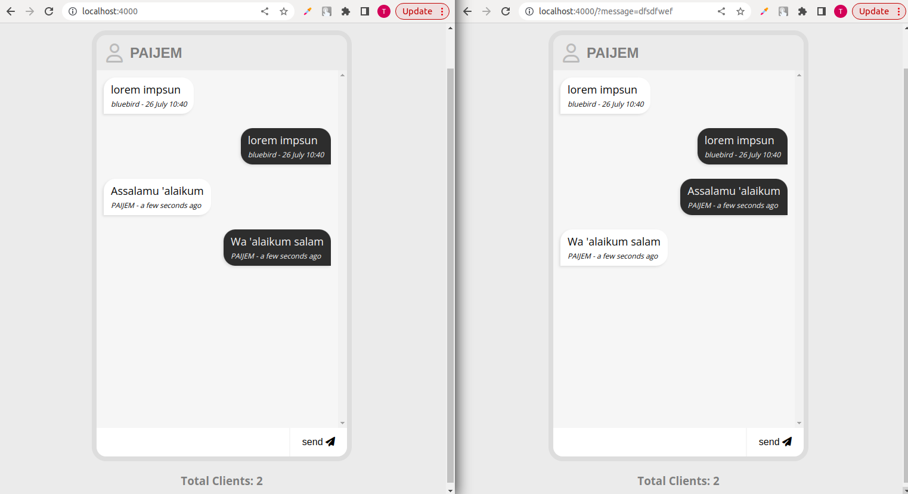

# Membuat aplikasi chat dengan websocket




## Inisialisasi Project
1. Buatlah folder untuk project chatting (gunakan terminal)
    ```
    mkdir chat-websocket
    ```
2. Inisialisasi project node js
    ```
    npm init -y
    ```
3. Install dependensi
    ```
    npm isntall --save express socket.io
    ```

    ```
    npm install --save-dev nodemon
    ```
4. open project menggunakan vscode
    ```
    code .
    ```
5. Buatlah file app.js dan folder public
    ```
    touch app.js

    mkdir public
    ```
6. Ubah konfigurasi di file package.json
    ```
    "scripts": {
        "start": "node app.js",
        "dev": "nodemon app.js",
        "test": "echo \"Error: no test specified\" && exit 1"
    }
    ```
7. Inisialisasi express, ubah pada file app.js
    ```
    const express = require('express')
    const path = require('path')
    const app = express()
    const port = process.env.PORT || 4000
    const server = app.listen(port, ()=> console.log(`Server running in ${port}`))


    app.use(express.static(path.join(__dirname, 'public')))
    ```
8. Kemudian buat file index.html di folder public
    ```
    ketikan ! enter

    <!DOCTYPE html>
    <html lang="en">
    <head>
        <meta charset="UTF-8">
        <meta http-equiv="X-UA-Compatible" content="IE=edge">
        <meta name="viewport" content="width=device-width, initial-scale=1.0">
        <title>Document</title>
    </head>
    <body>
        
    </body>
    </html>
    ```
9. Jalankan server 
    ```
    npm run dev

    npm start
    ```
## Html dasar untuk User Interface
1. Ubah di file index.html

2. Mencari dan menambahkan font
    cari font di https://cdnjs.com/libraries/font-awesome

    copy link tag dan paste ke dalam tag head
    ```
    <link rel="stylesheet" href="https://cdnjs.cloudflare.com/ajax/libs/font-awesome/6.3.0/css/all.min.css" integrity="sha512-SzlrxWUlpfuzQ+pcUCosxcglQRNAq/DZjVsC0lE40xsADsfeQoEypE+enwcOiGjk/bSuGGKHEyjSoQ1zVisanQ==" crossorigin="anonymous" referrerpolicy="no-referrer" />
    ```
3. Ui html dasar di file index.html
    ```
    <!DOCTYPE html>
    <html lang="en">
        <head>
            <meta charset="UTF-8">
            <meta http-equiv="X-UA-Compatible" content="IE=edge">
            <link rel="stylesheet" href="https://cdnjs.cloudflare.com/ajax/libs/font-awesome/6.3.0/css/all.min.css" integrity="sha512-SzlrxWUlpfuzQ+pcUCosxcglQRNAq/DZjVsC0lE40xsADsfeQoEypE+enwcOiGjk/bSuGGKHEyjSoQ1zVisanQ==" crossorigin="anonymous" referrerpolicy="no-referrer" />
            <meta name="viewport" content="width=device-width, initial-scale=1.0">
            <title>Chat App</title>
        </head>
        <body>
            <h1>iChat ...</h1>
            <div class="main">
                <div class="name">
                    <span><i class="far fa-user"></i></span>
                    <input type="text" 
                    id="name-input" 
                    class="name-input" 
                    value="anonymous" maxlength="20" />
                </div>

                <ul class="message-container" id="message-container">
                    <li class="message-left">
                        <p class="message">
                            lorem impsun
                            <span>bluebird - 26 July 10:40</span>
                        </p>
                    </li>

                    <li class="message-right">
                        <p class="message">
                            lorem impsun
                            <span>bluebird - 26 July 10:40</span>
                        </p>
                    </li>

                    <li class="message-feedback">
                        <p class="feedback" id="feedback">
                            killer is typing a message
                        </p>
                    </li>
                </ul>
                <form class="message-form form" id="message">
                    <input type="text" name="message" id="message-input" class="message-input">
                    <div class="v-divider"></div>
                    <button type="submit" class="send-button">
                        send <span><i class="fas fa-paper-plane"></i></span>
                    </button>
                </form>
                <h3 class="clients-total" id="clients-total">Total clients: 2</h3>
            </div>
        </body>
    </html>
    ```
## Styling with CSS
1. Tambahkan code ini dalam tag head file index.html dan buat file style.css
    ```
    <link rel="stylesheet" href="style.css">
    ```
2. Mencari font di https://fonts.google.com/

3. Isi dile style.css
    ```
    @import url('https://fonts.googleapis.com/css2?family=Open+Sans:wght@400;700&display=swap');

    *{
        margin: 0;
        padding: 0;
        box-sizing: border-box;
        scroll-behavior: smooth;
    }

    body{
        font-family: 'Open Sans', sans-serif;
        /* display: flex;
        flex-direction: column;
        justify-content: center;
        align-items: center; */

        display: grid;
        place-items: center;
        background-color: #ebebeb;
    }

    .title{
        margin: 20px 0;
    }

    .main{
        border: 8px solid #dddddd;
        border-radius: 24px;
        overflow: hidden;
    }

    .name{
        display: flex;
        font-size: 32px;
        font-weight: 700;
        padding: 8px 16px;
        color: #7e7e7e;
        background-color: #ebebeb;
    }

    .name > span{
        color: #bbb;
    }


    .name-input{
        font-size: 24px;
        font-weight: 700;
        color: #7e7e7e;
        flex-grow: 1;
        border: none;
        margin: 0px 12px;
        outline: none;
        background-color: #ebebeb;
    }

    .message-container{
        display: flex;
        flex-direction: column;
        background-color: #f6f6f6;
        width: 420px;
        height: 600px;
        overflow-y: scroll;
        overflow-x: hidden;
    }

    .message-left, .message-right{
        padding: 8px 12px;
        margin: 12px;
        max-width: 250px;
        font-size: 18px;
        word-wrap: break-word;
    }

    .message-left{
        border-radius: 20px 20px 20px 0px;
        align-self: flex-start;
        background-color: #fff;
        box-shadow: -2px 2px 4px #dcdcdc;
    }

    .message-right{
        border-radius: 20px 20px 0px 20px;
        align-self: flex-end;
        background-color: #2d2d2d;
        box-shadow: -2px 2px 4px #dcdcdc;
        color: #f6f6f6;
    }

    .message-left > p > span, .message-right > p > span{
        display: block;
        font-style: italic;
        font-size: 12px;
        margin-top: 4px;
    }

    .feedback{
        font-style: italic;
        font-size: 14px;
        padding: 0px 16px 16px 16px;
        color: #2d2d2d;
        text-align: center;
    }

    .message-form{
        display: flex;
        justify-content: space-between;
        width: 420px;
    }

    .message-input{
        flex-grow: 1;
        height: 48px;
        font-size: 16px;
        border: none;
        outline: none;
        padding: 0 12px;
        background-color: #fff;
    }

    .send-button{
        height: 48px;
        font-size: 16px;
        border: none;
        padding: 0px 20px;
        outline: none;
        background-color: #fff;
        cursor: pointer;
    }

    .v-divider{
        height: 48px;
        width: 2px;
        background-color: #f6f6f6;
    }

    .clients-total{
        margin: 20px 0px;
        color: #7e7e7e;
    }
    ```
4. Isi file index.html
    ```
    <!DOCTYPE html>
    <html lang="en">
        <head>
            <meta charset="UTF-8">
            <meta http-equiv="X-UA-Compatible" content="IE=edge">
            <link rel="stylesheet" href="https://cdnjs.cloudflare.com/ajax/libs/font-awesome/6.3.0/css/all.min.css" integrity="sha512-SzlrxWUlpfuzQ+pcUCosxcglQRNAq/DZjVsC0lE40xsADsfeQoEypE+enwcOiGjk/bSuGGKHEyjSoQ1zVisanQ==" crossorigin="anonymous" referrerpolicy="no-referrer" />
            <meta name="viewport" content="width=device-width, initial-scale=1.0">
            <link rel="stylesheet" href="style.css">
            <title>Chat App</title>
        </head>
        <body>
            <h1 class="title">iChat ...</h1>
            <div class="main">
                <div class="name">
                    <span><i class="far fa-user"></i></span>
                    <input type="text" 
                    id="name-input" 
                    class="name-input" 
                    value="anonymous" maxlength="20" />
                </div>

                <ul class="message-container" id="message-container">
                    <li class="message-left">
                        <p class="message">
                            lorem impsun
                            <span>bluebird - 26 July 10:40</span>
                        </p>
                    </li>

                    <li class="message-right">
                        <p class="message">
                            lorem impsun
                            <span>bluebird - 26 July 10:40</span>
                        </p>
                    </li>

                    <li class="message-feedback">
                        <p class="feedback" id="feedback">
                            killer is typing a message
                        </p>
                    </li>
                </ul>
                <form class="message-form form" id="message">
                    <input type="text" name="message" id="message-input" class="message-input">
                    <div class="v-divider"></div>
                    <button type="submit" class="send-button">
                        send <span><i class="fas fa-paper-plane"></i></span>
                    </button>
                </form>
            </div>
            <h3 class="clients-total" id="clients-total">Total clients: 2</h3>
        </body>
    </html>
    ```
## Create Websocket
1. Ubah value di `Total Client: `. Silakan tambahkan syntac di app.js, index.html, dan buat file main.js di folder public
    
    ```
    app.js
    ------

    const express = require('express')
    const path = require('path')
    const app = express()
    const port = process.env.PORT || 4000
    const server = app.listen(port, ()=> console.log(`Server running in ${port}`))

    // import websocket
    const io = require('socket.io')(server)

    // menampilkan file index.html
    app.use(express.static(path.join(__dirname, 'public')))

    let socketsConected = new Set()

    // kirim data ke client side
    io.on('connection', onConnected)

    function onConnected(socket){
        console.log("Socket Connected: ",socket.id);
        socketsConected.add(socket.id)

        io.emit('clients-total', socketsConected.size)

        socket.on('disconnect', ()=>{
            console.log('Socket disconnected: ', socket.id);
            socketsConected.delete(socket.id)
            io.emit('clients-total', socketsConected.size)
        })
    }
    ```

    ```
    index.html
    ----------

    <!DOCTYPE html>
    <html lang="en">
        <head>
            <meta charset="UTF-8">
            <meta http-equiv="X-UA-Compatible" content="IE=edge">
            <link rel="stylesheet" href="https://cdnjs.cloudflare.com/ajax/libs/font-awesome/6.3.0/css/all.min.css" integrity="sha512-SzlrxWUlpfuzQ+pcUCosxcglQRNAq/DZjVsC0lE40xsADsfeQoEypE+enwcOiGjk/bSuGGKHEyjSoQ1zVisanQ==" crossorigin="anonymous" referrerpolicy="no-referrer" />
            <meta name="viewport" content="width=device-width, initial-scale=1.0">
            <link rel="stylesheet" href="style.css">
            <title>Chat App</title>
        </head>
        <body>
            <h1 class="title">iChat ...</h1>
            <div class="main">
                <div class="name">
                    <span><i class="far fa-user"></i></span>
                    <input type="text" 
                    id="name-input" 
                    class="name-input" 
                    value="anonymous" maxlength="20" />
                </div>

                <ul class="message-container" id="message-container">
                    <li class="message-left">
                        <p class="message">
                            lorem impsun
                            <span>bluebird - 26 July 10:40</span>
                        </p>
                    </li>

                    <li class="message-right">
                        <p class="message">
                            lorem impsun
                            <span>bluebird - 26 July 10:40</span>
                        </p>
                    </li>

                    <li class="message-feedback">
                        <p class="feedback" id="feedback">
                            killer is typing a message
                        </p>
                    </li>
                </ul>
                <form class="message-form form" id="message-form">
                    <input type="text" name="message" id="message-input" class="message-input">
                    <div class="v-divider"></div>
                    <button type="submit" class="send-button">
                        send <span><i class="fas fa-paper-plane"></i></span>
                    </button>
                </form>
            </div>
            <h3 class="clients-total" id="clients-total">Total clients: 2</h3>
            <script src="/socket.io/socket.io.js"></script>
            <script src="main.js"></script>
        </body>
    </html>
    ```

    ```
    main.js
    -------

    const socket = io()

    // ubah element by id in tag H3
    const clientsTotal = document.getElementById('clients-total')

    // terima data dari server side
    socket.on('clients-total', (data)=>{
        // console.log('clients connected: ',data);

        // menampilkan data ke client side
        clientsTotal.innerText = `Total Clients: ${data}`

    })

    ```
2. Websocket chat-message
    ```
    main.js
    -------

    const socket = io()

    // ubah element by id in tag H3
    const clientsTotal = document.getElementById('clients-total')
    const messageContainer = document.getElementById('message-container')
    const nameInput = document.getElementById('name-input')
    const messageForm = document.getElementById('message-form')
    const messageInput = document.getElementById('message-input')

    // event listener message form
    messageForm.addEventListener('submit', (e)=>{
        e.preventDefault()
        sendMessage()
    })

    // terima data dari server side
    socket.on('clients-total', (data)=>{
        // console.log('clients connected: ',data);

        // menampilkan data ke client side
        clientsTotal.innerText = `Total Clients: ${data}`

    })


    function sendMessage(){
        
        console.log('message input: ', messageInput.value);
        
        // ambil data dari client side
        const data = {
            name: nameInput.value,
            message: messageInput.value,
            dateTime: new Date()
        }

        // kirim data ke server side
        socket.emit('message', data)
    }

    // terima data dari server side
    socket.on('chat-message', (data)=>{
        console.log('data chat dari server: ', data);
    })

    ```

    ```
    app.js
    ------

    const express = require('express')
    const path = require('path')
    const app = express()
    const port = process.env.PORT || 4000
    const server = app.listen(port, ()=> console.log(`Server running in ${port}`))

    // import websocket
    const io = require('socket.io')(server)

    // menampilkan file index.html
    app.use(express.static(path.join(__dirname, 'public')))

    let socketsConected = new Set()

    // kirim data ke client side
    io.on('connection', onConnected)

    function onConnected(socket){
        console.log("Socket Connected: ",socket.id);
        socketsConected.add(socket.id)

        // kirim data ke client side
        io.emit('clients-total', socketsConected.size)

        socket.on('disconnect', ()=>{
            console.log('Socket disconnected: ', socket.id);
            socketsConected.delete(socket.id)
            io.emit('clients-total', socketsConected.size)
        })

        // terima data dari client side
        socket.on('message', (data)=>{
            // kirim kembali ke client side
            console.log('data dari client: ', data);
            socket.broadcast.emit('chat-message', data)
        })


    }
    ```
3. Ubah element chat
    library handling moment
    - https://momentjs.com/
    - https://cdnjs.com/libraries/moment.js
    - jika ada error: https://stackoverflow.com/questions/53239963/bootstrap-popper-js-failed-to-find-a-valid-digest-in-the-integrity-attribute-f


    ```
    main.js
    -------
    const socket = io()

    // ubah element by id in tag H3
    const clientsTotal = document.getElementById('clients-total')
    const messageContainer = document.getElementById('message-container')
    const nameInput = document.getElementById('name-input')
    const messageForm = document.getElementById('message-form')
    const messageInput = document.getElementById('message-input')

    // event listener message form
    messageForm.addEventListener('submit', (e)=>{
        e.preventDefault()
        sendMessage()
    })

    // terima data dari server side
    socket.on('clients-total', (data)=>{
        // console.log('clients connected: ',data);

        // menampilkan data ke client side
        clientsTotal.innerText = `Total Clients: ${data}`

    })


    function sendMessage(){
        if(messageInput.value==='') return
        // console.log('message input: ', messageInput.value);
        
        // ambil data dari client side
        const data = {
            name: nameInput.value,
            message: messageInput.value,
            dateTime: new Date()
        }

        // kirim data ke server side
        socket.emit('message', data)

        addMessageToUI(true, data)
        messageInput.value = ''
    }

    // terima data dari server side
    socket.on('chat-message', (data)=>{
        // console.log('data chat dari server: ', data);
        addMessageToUI(false, data)
    })


    function addMessageToUI(isOwnMessage, data){
        const element = `
            <li class="${isOwnMessage ? "message-right" : "message-left"}">
                <p class="message">
                    ${data.message}
                    <span>${data.name} - ${moment(data.dateTime).fromNow()}</span>
                </p>
            </li>
        `

        messageContainer.innerHTML += element
        scrollToBottom()
    }

    function scrollToBottom(){
        messageContainer.scrollTo(0, messageContainer.scrollHeight)
    }
    ```
    ```
    app.js
    -------

    const express = require('express')
    const path = require('path')
    const app = express()
    const port = process.env.PORT || 4000
    const server = app.listen(port, ()=> console.log(`Server running in ${port}`))

    // import websocket
    const io = require('socket.io')(server)

    // menampilkan file index.html
    app.use(express.static(path.join(__dirname, 'public')))

    let socketsConected = new Set()

    // kirim data ke client side
    io.on('connection', onConnected)

    function onConnected(socket){
        console.log("Socket Connected: ",socket.id);
        socketsConected.add(socket.id)

        // kirim data ke client side
        io.emit('clients-total', socketsConected.size)

        socket.on('disconnect', ()=>{
            console.log('Socket disconnected: ', socket.id);
            socketsConected.delete(socket.id)
            io.emit('clients-total', socketsConected.size)
        })

        // terima data dari client side
        socket.on('message', (data)=>{
            // kirim kembali ke client side
            console.log('data dari client: ', data);
            socket.broadcast.emit('chat-message', data)
        })


    }
    ```
    ```
    index.html
    ----------

    <!DOCTYPE html>
    <html lang="en">
        <head>
            <meta charset="UTF-8">
            <meta http-equiv="X-UA-Compatible" content="IE=edge">
            <link rel="stylesheet" href="https://cdnjs.cloudflare.com/ajax/libs/font-awesome/6.3.0/css/all.min.css" integrity="sha512-SzlrxWUlpfuzQ+pcUCosxcglQRNAq/DZjVsC0lE40xsADsfeQoEypE+enwcOiGjk/bSuGGKHEyjSoQ1zVisanQ==" crossorigin="anonymous" referrerpolicy="no-referrer" />
            <meta name="viewport" content="width=device-width, initial-scale=1.0">
            <link rel="stylesheet" href="style.css">
            <title>Chat App</title>
        </head>
        <body>
            <h1 class="title">iChat ...</h1>
            <div class="main">
                <div class="name">
                    <span><i class="far fa-user"></i></span>
                    <input type="text" 
                    id="name-input" 
                    class="name-input" 
                    value="anonymous" maxlength="20" />
                </div>

                <ul class="message-container" id="message-container">
                    <li class="message-left">
                        <p class="message">
                            lorem impsun
                            <span>bluebird - 26 July 10:40</span>
                        </p>
                    </li>

                    <li class="message-right">
                        <p class="message">
                            lorem impsun
                            <span>bluebird - 26 July 10:40</span>
                        </p>
                    </li>

                    <li class="message-feedback">
                        <p class="feedback" id="feedback">
                            killer is typing a message
                        </p>
                    </li>
                </ul>
                <form class="message-form form" id="message-form">
                    <input type="text" name="message" id="message-input" class="message-input">
                    <div class="v-divider"></div>
                    <button type="submit" class="send-button">
                        send <span><i class="fas fa-paper-plane"></i></span>
                    </button>
                </form>
            </div>
            <h3 class="clients-total" id="clients-total">Total clients: 2</h3>
            <script src="/socket.io/socket.io.js"></script>
            <script src="https://cdnjs.cloudflare.com/ajax/libs/moment.js/2.28.0/moment.min.js" 
                integrity="sha512-Q1f3TS3vSt1jQ8AwP2OuenztnLU6LwxgyyYOG1jgMW/cbEMHps/3wjvnl1P3WTrF3chJUWEoxDUEjMxDV8pujg==" 
                crossorigin="anonymous" 
                ></script>
            <script src="main.js"></script>
        </body>
    </html>
    ```

4. Ubah element feedback

    ```
    index.html
    ----------

    <!DOCTYPE html>
    <html lang="en">
        <head>
            <meta charset="UTF-8">
            <meta http-equiv="X-UA-Compatible" content="IE=edge">
            <link rel="stylesheet" href="https://cdnjs.cloudflare.com/ajax/libs/font-awesome/6.3.0/css/all.min.css" integrity="sha512-SzlrxWUlpfuzQ+pcUCosxcglQRNAq/DZjVsC0lE40xsADsfeQoEypE+enwcOiGjk/bSuGGKHEyjSoQ1zVisanQ==" crossorigin="anonymous" referrerpolicy="no-referrer" />
            <meta name="viewport" content="width=device-width, initial-scale=1.0">
            <link rel="stylesheet" href="style.css">
            <title>Chat App</title>
        </head>
        <body>
            <h1 class="title">iChat ...</h1>
            <div class="main">
                <div class="name">
                    <span><i class="far fa-user"></i></span>
                    <input type="text" 
                    id="name-input" 
                    class="name-input" 
                    value="anonymous" maxlength="20" />
                </div>

                <ul class="message-container" id="message-container">
                    <li class="message-left">
                        <p class="message">
                            lorem impsun
                            <span>bluebird - 26 July 10:40</span>
                        </p>
                    </li>

                    <li class="message-right">
                        <p class="message">
                            lorem impsun
                            <span>bluebird - 26 July 10:40</span>
                        </p>
                    </li>

                    <li class="message-feedback">
                        <p class="feedback" id="feedback">
                            killer is typing a message
                        </p>
                    </li>
                </ul>
                <form class="message-form form" id="message-form">
                    <input type="text" name="message" id="message-input" class="message-input">
                    <div class="v-divider"></div>
                    <button type="submit" class="send-button">
                        send <span><i class="fas fa-paper-plane"></i></span>
                    </button>
                </form>
            </div>
            <h3 class="clients-total" id="clients-total">Total clients: 2</h3>
            <script src="/socket.io/socket.io.js"></script>
            <script src="https://cdnjs.cloudflare.com/ajax/libs/moment.js/2.28.0/moment.min.js" 
                integrity="sha512-Q1f3TS3vSt1jQ8AwP2OuenztnLU6LwxgyyYOG1jgMW/cbEMHps/3wjvnl1P3WTrF3chJUWEoxDUEjMxDV8pujg==" 
                crossorigin="anonymous" 
                ></script>
            <script src="main.js"></script>
        </body>
    </html>
    ```

    ```
    app.js
    -------

    const express = require('express')
    const path = require('path')
    const app = express()
    const port = process.env.PORT || 4000
    const server = app.listen(port, ()=> console.log(`Server running in ${port}`))

    // import websocket
    const io = require('socket.io')(server)

    // menampilkan file index.html
    app.use(express.static(path.join(__dirname, 'public')))

    let socketsConected = new Set()

    // kirim data ke client side
    io.on('connection', onConnected)

    function onConnected(socket){
        console.log("Socket Connected: ",socket.id);
        socketsConected.add(socket.id)

        // kirim data ke client side
        io.emit('clients-total', socketsConected.size)

        socket.on('disconnect', ()=>{
            console.log('Socket disconnected: ', socket.id);
            socketsConected.delete(socket.id)
            io.emit('clients-total', socketsConected.size)
        })

        // terima data dari client side
        socket.on('message', (data)=>{
            // kirim kembali ke client side
            console.log('data dari client: ', data);
            socket.broadcast.emit('chat-message', data)
        })

        socket.on('feedback', (data)=>{
            socket.broadcast.emit('feedback', data)
        })

    }
    ```

    ```
    main.js
    -------

    const socket = io()

    // ubah element by id in tag H3
    const clientsTotal = document.getElementById('clients-total')
    const messageContainer = document.getElementById('message-container')
    const nameInput = document.getElementById('name-input')
    const messageForm = document.getElementById('message-form')
    const messageInput = document.getElementById('message-input')

    const messageTone = new Audio('./message-tone.mp3')

    // event listener message form
    messageForm.addEventListener('submit', (e)=>{
        e.preventDefault()
        sendMessage()
    })

    // terima data dari server side
    socket.on('clients-total', (data)=>{
        // console.log('clients connected: ',data);

        // menampilkan data ke client side
        clientsTotal.innerText = `Total Clients: ${data}`

    })


    function sendMessage(){
        if(messageInput.value==='') return
        // console.log('message input: ', messageInput.value);
        
        // ambil data dari client side
        const data = {
            name: nameInput.value,
            message: messageInput.value,
            dateTime: new Date()
        }

        // kirim data ke server side
        socket.emit('message', data)

        addMessageToUI(true, data)
        messageInput.value = ''
    }

    // terima data dari server side
    socket.on('chat-message', (data)=>{
        // console.log('data chat dari server: ', data);
        messageTone.play()
        addMessageToUI(false, data)
    })


    function addMessageToUI(isOwnMessage, data){
        clearFeedback()
        const element = `
            <li class="${isOwnMessage ? "message-right" : "message-left"}">
                <p class="message">
                    ${data.message}
                    <span>${data.name} - ${moment(data.dateTime).fromNow()}</span>
                </p>
            </li>
        `

        messageContainer.innerHTML += element
        scrollToBottom()
    }

    function scrollToBottom(){
        messageContainer.scrollTo(0, messageContainer.scrollHeight)
    }

    messageInput.addEventListener('focus',(e)=>{
        socket.emit('feedback',{
            feedback:`🔭 ${nameInput.value} is typing a message ...`
        })
    })

    messageInput.addEventListener('keypress', (e)=>{
        socket.emit('feedback',{
            feedback:`🔭 ${nameInput.value} is typing a message ...`
        })
    })

    messageInput.addEventListener('blur', (e)=>{
        socket.emit('feedback',{
            feedback:''
        })
    })


    socket.on('feedback', (data)=>{
        clearFeedback()
        const element = `
            <li class="message-feedback">
                <p class="feedback" id="feedback">
                    ${data.feedback}
                </p>
            </li>
        `
        messageContainer.innerHTML += element
    })

    function clearFeedback(){
        document.querySelectorAll('li.message-feedback').forEach(element=>{
            element.parentNode.removeChild(element)
        })
    }
    ```


## Snipped
```
ketikan ! enter

<!DOCTYPE html>
<html lang="en">
    <head>
        <meta charset="UTF-8">
        <meta http-equiv="X-UA-Compatible" content="IE=edge">
        <meta name="viewport" content="width=device-width, initial-scale=1.0">
        <title>Document</title>
    </head>
    <body>
        
    </body>
</html>

p.feedback#feedback
<p class="feedback" id="feedback"></p>

p.feedback
<p class="feedback"></p>

input:text
<input type="text" name="" id="">

link:css
<link rel="stylesheet" href="style.css">

```

```
package
live server ---> untuk menjalankan file html secara live
```

Reference:
- https://www.youtube.com/watch?v=gZvpCiPIzW0&list=PLdHg5T0SNpN09AlLBAYahKZUrAWsIL7No&index=7


